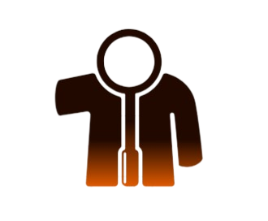

# Resume Radar - AI-Powered Resume Evaluation System

 

**Resume Radar** is an advanced AI-based resume evaluation tool that leverages the locally-installed **Ollama3** LLM to provide comprehensive resume analysis and feedback. This system offers both administrator and standard user interfaces for seamless resume evaluation.

---

## 🚀 Features

- 🤖 AI-powered resume analysis using **LLaMA 3** via **Ollama**
- 🔐 Local processing ensures **data privacy**
- 👤 Dual interface: **Administrator** and **Standard User**
- ⏱️ Real-time processing metrics
- 🌐 Responsive and user-friendly web interface

---

## 💻 System Requirements

- Windows 10/11 or Linux
- Python 3.9+
- PowerShell 7+
- NVIDIA GPU (recommended) with CUDA support
- 8GB+ RAM (16GB recommended)
- Ollama3 model installed locally

---

## ⚙️ Installation

### 1. Clone the Repository

```bash

git clone https://github.com/yourusername/Resume_Radar.git
cd Resume_Radar

```

### 2. Set Up Python Environment

```powershell

# Create virtual environment
python -m venv venv

# Activate environment
.\venv\Scripts\activate

# Install dependencies
pip install -r requirements.txt

```
### 3. Install Ollama (One-Time Setup)

🔧 Windows

1. Download the installer from the official Ollama site:
👉 https://ollama.com/download

2. Run the installer and follow the setup instructions.

3. After installation, verify it in PowerShell:

``` powershell

ollama --version # Check Ollama's Version - You should see the installed version of Ollama.

```
🐧 Linux (Debian/Ubuntu)

```bash

curl -fsSL https://ollama.com/install.sh | sh

```
Then verify:

```bash

ollama --version

```

💡 You might need to restart your shell or system after installation for changes to take effect.

### 4. Install the LLAMA 3 Model

Once Ollama is installed, pull the required model:

```powershell

ollama pull llama3 

```

Then Verify:

```

ollama list

```

## 📁 Project Structure

```bash

Resume_Radar/
├── backend/
│   ├── venv/                # Python virtual environment
│   ├── uploads/             # Resume storage directory
│   ├── .env                 # Environment configuration
│   ├── app.py               # Flask application
│   └── requirements.txt     # Python dependencies
├── frontend/
│   ├── assets/
│   │   ├── logo-lightmode.png
│   │   └── logo-nightmode.png
│   ├── css/
│   │   └── style.css        # Frontend styles
│   ├── js/
│   │   └── script.js        # Frontend logic
│   └── index.html           # Main interface
└── README.md                # This documentation

```

## 👨‍💻 Usage

### Administrator Mode

1. Open PowerShell as Administrator

2. Navigate to the project directory:

```powershell

cd "E:\Documents\Website and portfolio\resume\backend"

```

3. Activate the virtual environment:

```powershell

.\venv\Scripts\activate

```

4. Start the Flask application:

```powershell

python app.py

```

### Standard User Mode

1. Open PowerShell

2. Use the following commands:

```powershell

ollama list               # Check available models
ollama pull llama3        # Ensure model is available
ollama serve              # Start model server

```

## 📡 API Endpoints

POST /api/analyze – Submit resume for analysis

POST /api/generate – Generate evaluation report


## 🛠️ Troubleshooting

### Model not loading:

1. Verify Ollama3 is properly installed

2. Check GPU drivers and CUDA setup

3. Ensure sufficient system resources

### API timeouts:

1. Increase timeout limits in frontend configuration

2. Ensure Ollama server is running

## 📄 License

This project is licensed under the MIT License. See the LICENSE file for details.

## 🤝 Contributing

Pull requests are welcome. For major changes, please open an issue first to discuss what you’d like to change.

## 🙏 Acknowledgments

Ollama for the LLM framework

Flask for backend services


